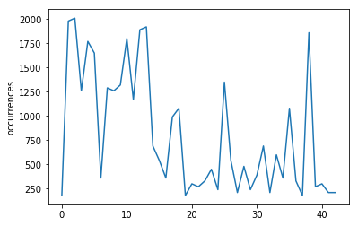
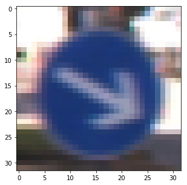
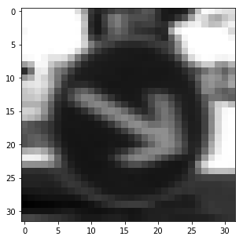
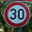
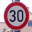
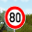
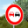

# **Traffic Sign Recognition** 

## Writeup

---

**Build a Traffic Sign Recognition Project**

The goals / steps of this project are the following:
* Load the data set (see below for links to the project data set)
* Explore, summarize and visualize the data set
* Design, train and test a model architecture
* Use the model to make predictions on new images
* Analyze the softmax probabilities of the new images
* Summarize the results with a written report

[//]: # (Image References)

[image1]: ./examples/visualization.jpg "Visualization"
[image2]: ./examples/grayscale.jpg "Grayscaling"
[image3]: ./examples/random_noise.jpg "Random Noise"
[image4]: ./examples/placeholder.png "Traffic Sign 1"
[image5]: ./examples/placeholder.png "Traffic Sign 2"
[image6]: ./examples/placeholder.png "Traffic Sign 3"
[image7]: ./examples/placeholder.png "Traffic Sign 4"
[image8]: ./examples/placeholder.png "Traffic Sign 5"

## Rubric Points
### Here I will consider the [rubric points](https://review.udacity.com/#!/rubrics/481/view) individually and describe how I addressed each point in my implementation.  

---
### Writeup / README

#### 1. Provide a Writeup / README that includes all the rubric points and how you addressed each one. You can submit your writeup as markdown or pdf. You can use this template as a guide for writing the report. The submission includes the project code.

You're reading it! and here is a link to my [project code](https://github.com/mwolfram/CarND-Traffic-Sign-Classifier-Project-mwolfram/blob/master/Traffic_Sign_Classifier.ipynb)

### Toolkit implementation at beginning of notebook

I implemented some helpers and convenience functions at the beginning of the jupyter notebook, so I can easily reload them, without actually running any calculations

### Data Set Summary & Exploration

#### 1. Provide a basic summary of the data set and identify where in your code the summary was done. In the code, the analysis should be done using python, numpy and/or pandas methods rather than hardcoding results manually.

I used standard python to calculate summary statistics of the traffic
signs data set:

* The size of training set is 34799
* The size of test set is 12630
* The shape of a traffic sign image is 32x32x3 (3 color channels)
* The number of unique classes/labels in the data set is ? 43

#### 2. Include an exploratory visualization of the dataset and identify where the code is in your code file.

The code for this step is contained below the label "Provide a Basic Summary of the Data Set Using Python, Numpy and/or Pandas" in the IPython notebook.  

Here is an exploratory visualization of the data set. It is a chart showing the number of occurrences of each sign:

### Design and Test a Model Architecture

#### 1. Describe how, and identify where in your code, you preprocessed the image data. What tecniques were chosen and why did you choose these techniques? Consider including images showing the output of each preprocessing technique. Pre-processing refers to techniques such as converting to grayscale, normalization, etc.
                                                                  
The code for this step is contained at the beginning of the jupyter notebook, in the toolkit section. I apply the "preprocess" function to all datasets I use.

As a first step, I decided to convert the images to grayscale (rgb2gray) just to see the difference. Also the images were always normalized. As shown in class, it is important to keep values low and the median around zero.

Here is an example of a traffic sign image before and after grayscaling.

Later in the project, I removed the grayscaling step and instead enabled the LeNet architecture to learn the most effective preprocessing step on its own. This was done using a 1x1x10 filter followed by a 1x1x3 to get back to the original depth. These filters can be found at the beginnning of the LeNet function (filter1, filter2).

#### 2. Describe how, and identify where in your code, you set up training, validation and testing data. How much data was in each set? Explain what techniques were used to split the data into these sets. (OPTIONAL: As described in the "Stand Out Suggestions" part of the rubric, if you generated additional data for training, describe why you decided to generate additional data, how you generated the data, identify where in your code, and provide example images of the additional data)

I used the data that was provided already. I did not use cross-validation. So the X_train set was used as a basis for all training data, and X_valid and X_test respectively. I did, however, shuffle my data before training. Interestingly, this had a huge impact on the result (under 1% accuracy before shuffling, over 80% after)

So my final training set still had 34799 images. My validation set and test set had 4410 and 12630 number of images.

TODO Augmentation
The sixth code cell of the IPython notebook contains the code for augmenting the data set. I decided to generate additional data because ... To add more data to the the data set, I used the following techniques because ... 

Here is an example of an original image and an augmented image:

![alt text][image3]

The difference between the original data set and the augmented data set is the following ... 

#### 3. Describe, and identify where in your code, what your final model architecture looks like including model type, layers, layer sizes, connectivity, etc.) Consider including a diagram and/or table describing the final model.

The code for my final model is located in the jupyter notebook below the label "Model Architecture", in the LeNet function. 

My final model consisted of the following layers:

| Layer         		|     Description	        					| 
|:---------------------:|:---------------------------------------------:| 
| Input         		| 32x32x3 RGB image   							| 
| 1x1x10 filter    		| 1x1 size filter with output depth 10, 1x1 stride, valid padding 	| 
| RELU         		|    							| 
| 1x1x3 filter         		| 1x1 size filter with output depth 3, 1x1 stride, valid padding, to get back to the original 3 channels   							| 
| RELU         		| 					| 
| Convolution 5x5     	| 1x1 stride, valid padding, outputs 28x28x6 	|
| RELU					|												|
| Max pooling	      	| 2x2 stride,  outputs 14x14x6 				|
| Convolution 5x5	    | 1x1 stride, valid padding, outputs 10x10x16   									|
| RELU                |                |
| Max pooling         | 2x2 stride, outputs 5x5x16             |
| Fully connected		| input 5x5x16 flattened = 400, output 120        									|
| RELU                |                |
| Fully connected     | input 120, output 84               |
| RELU                |                |
| Dropout                |                |
| Fully connected     | input 84, output 43     |
| Softmax				|         									|

#### 4. Describe how, and identify where in your code, you trained your model. The discussion can include the type of optimizer, the batch size, number of epochs and any hyperparameters such as learning rate.

The code for training the model is located in the same cell as the model itself.

To train the model, I used an AdamOptimizer. The labels were one-hot encoded using tensorflow's internal module tf.one_hot. Cross entropy was used as the loss function. The model was trained in 15 epochs, with a batch size of 50. These hyperparameters can be set on top of the jupyter notebook. The learning rate was 0.001.

#### 5. Describe the approach taken for finding a solution. Include in the discussion the results on the training, validation and test sets and where in the code these were calculated. Your approach may have been an iterative process, in which case, outline the steps you took to get to the final solution and why you chose those steps. Perhaps your solution involved an already well known implementation or architecture. In this case, discuss why you think the architecture is suitable for the current problem.

The code for calculating the accuracy of the model is located in the same cell as the model itself, in the "evaluate" function. 

My final model results were:
* training set accuracy of ?
* validation set accuracy of 0.951
* test set accuracy of 0.933

* **What was the first architecture that was tried and why was it chosen?** The architecture chosen was LeNet, as it was said that it would yield fairly good results out of the box. The model had to be adapted to work with RGB images. Also, the number of logits had to be changed, as there are 43 different classes of traffic signs in the dataset, whereas in the MNIST dataset there are only 10.
* **What were some problems with the initial architecture?** The initial architecture was working fine, however, when data was not shuffled, it would yield accuracies below 1% on validation. It's still unclear why this was the case. Shuffling the data during training immediately improved the accuaracy to values above 80%.
* **How was the architecture adjusted and why was it adjusted? Typical adjustments could include choosing a different model architecture, adding or taking away layers (pooling, dropout, convolution, etc), using an activation function or changing the activation function. One common justification for adjusting an architecture would be due to over fitting or under fitting. A high accuracy on the training set but low accuracy on the validation set indicates over fitting; a low accuracy on both sets indicates under fitting.** A dropout layer was added as an experiment, which improved the accuracy. Also, instead of preprocessing the data (except normalization which is done in advance), two new filters were introduced that are designed to find out the preprocessing steps on their own. These were the first two 1x1 filters on top of the model.
* **Which parameters were tuned? How were they adjusted and why?** TBA
* **What are some of the important design choices and why were they chosen? For example, why might a convolution layer work well with this problem? How might a dropout layer help with creating a successful model?** A dropout layer was added to reduce overfitting TBA

### Test a Model on New Images

#### 1. Choose five German traffic signs found on the web and provide them in the report. For each image, discuss what quality or qualities might be difficult to classify.

Here are eight German traffic signs that I found on the web:

| Image Label         		|     Image	        					| Notes |
|:---------------------:|:---------------------------------------------:|:---------------------------:|
| Speed Limit 30 (1)    |  | |
| Speed Limit 30 (2)    |  | |
| Speed Limit 80        |  | |
| No Passing            |  | |
| Stop                  |  | |
| No Entry              |  | | 
| Ahead only            |  | | 
| Go straight or right  |  | | 

#### 2. Discuss the model's predictions on these new traffic signs and compare the results to predicting on the test set. Identify where in your code predictions were made. At a minimum, discuss what the predictions were, the accuracy on these new predictions, and compare the accuracy to the accuracy on the test set (OPTIONAL: Discuss the results in more detail as described in the "Stand Out Suggestions" part of the rubric).

The code for making predictions on my final model is below the caption "Predict the Sign Type for Each Image" in the jupyter notebook. The accuracy was calculated one cell below.

All signs were recalled correctly, so the accuracy is at 100%, which is surprising in comparison with a test set accuracy of 93.3%. This might be because of the good lighting conditions in all of the images.

#### 3. Describe how certain the model is when predicting on each of the five new images by looking at the softmax probabilities for each prediction and identify where in your code softmax probabilities were outputted. Provide the top 5 softmax probabilities for each image along with the sign type of each probability. (OPTIONAL: as described in the "Stand Out Suggestions" part of the rubric, visualizations can also be provided such as bar charts)

The code for calculating the softmax probabilities is located below the label "Output Top 5 Softmax Probabilities For Each Image Found on the Web" in the jupyter notebook.

For the first image, the model is relatively sure that this is a stop sign (probability of 0.6), and the image does contain a stop sign. The top five soft max probabilities were

| Probability         	|     Prediction	        					| 
|:---------------------:|:---------------------------------------------:| 
| .60         			| Stop sign   									| 
| .20     				| U-turn 										|
| .05					| Yield											|
| .04	      			| Bumpy Road					 				|
| .01				    | Slippery Road      							|

For the second image ... 
